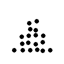
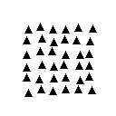

# Hierarchical Shape Composition Dataset

## Property Tested

This dataset tests whether an image classification model can distinguish **global** and **local** shape information in the same image.  More specifically, it tests hierarchical visual recognition: the ability to identify a large-scale shape formed by the spatial arrangement of smaller repeated shapes, while also recognizing the identity of those smaller constituent shapes. 

## Motivation

Navon’s work on global-local visual processing studies stimuli in which a large global form is composed of many smaller local elements [1]. For example, a large circle may be constructed from small squares. This creates two levels of visual information: the coarse global structure and the fine local constituents. Navon’s original paper argued that visual perception is not only about detecting isolated details, but also about how those details are organized into larger structures. This makes the paradigm a useful starting point for testing hierarchical visual recognition.

This dataset adapts the global-local paradigm into a controlled image classification setting. Each image has a global shape and a local shape, chosen independently from circle, square, and triangle. The target is therefore not just whether a model can recognize “a shape,” but whether it can separate two visual scales: the large shape defined by the spatial arrangement of elements, and the small shape defined by the repeated local components. Successful classification requires representing both levels of structure, rather than relying only on local texture-like cues or only on the global outline. Gerlach and Poirel [2] further motivate this connection by showing that Navon-style global-local processing is systematically related to visual object classification performance.

## Dataset Description

The dataset contains images generated from two independently chosen shape factors: the **global shape** and the **local shape**. The global shape is the large structure visible at the image level, while the local shape is the smaller repeated element used to construct that structure. Both factors are chosen from the same set of three shapes: circle, square, and triangle.

This gives a total of 3 × 3 = 9 possible global-local combinations. For example, one class may be a large circle made of small squares, while another may be a large triangle made of small circles. Each image is labeled by two shape attributes: one for the global form and one for the local constituent.

## Examples

| Global circle + local square                              | Global triangle + local circle                              | Global square + local triangle                              |
| --------------------------------------------------------- | ----------------------------------------------------------- | ----------------------------------------------------------- |
|  |  |  |

**Figure 1. Example global-local shape compositions.** Each image shows a different pairing of global and local shape labels. The examples illustrate that the global label depends on the large-scale arrangement, while the local label depends on the repeated small shapes.

## Generation Procedure

The dataset is generated using a small set of helper functions. The `draw_shape` function receives a bounding box, defined by the top-left and bottom-right coordinates, and draws the requested shape within that region. The `make_global_mask` function creates a black image of the same size as the final output, then draws the selected global shape in white inside the boundary defined by the `margin` parameter. This mask is used to determine where local shapes are allowed to be placed.

The `make_hierarchical_image` function starts from a blank white image. It then treats the global bounding region as a grid of candidate positions for local shapes. For each candidate position, the generator adds a small amount of random jitter, so the local shapes do not appear in a perfectly regular grid. This makes the generated images less trivial, because the exact local arrangement varies between examples.

For each candidate local shape, the code defines a local bounding box using the `local_size` parameter. To check whether this local shape would fit inside the global shape, the corresponding region of the global mask is extracted and averaged. Since the mask has value 255 inside the global shape and 0 outside it, a high average value means that the candidate local shape lies mostly inside the global form. The generator uses a threshold of 220: if the average mask value is above this threshold, the local shape is drawn; otherwise, the candidate position is skipped.

## Splits

The `generate_split` function creates a dataset split from a specified list of `(global_shape, local_shape)` pairs. This makes it possible to construct both standard in-distribution splits and more challenging out-of-distribution splits.

The in-distribution setting checks whether a model can recognize global-local combinations that come from the same distribution as the training data. This corresponds to ordinary supervised recognition over the nine possible hierarchical shape classes.

The out-of-distribution setting is more interesting. In this setting, some global-local combinations are held out during training and only appear at test time. For example, a model may see circles, squares, and triangles as both global and local shapes, but never see a large circle made of small triangles during training. This tests whether the model has learned the compositional structure of the task, rather than merely memorizing observed global-local pairings.

## Limitations

The dataset is intentionally synthetic and uses only three simple shape types. This makes the tested property easy to control, but it also limits the conclusions that can be drawn. The dataset should therefore be treated as a diagnostic control dataset for hierarchical global-local recognition, not as a general benchmark for real-world object recognition.

## Links

* Code and dataset: https://github.com/Neter0/FRMDL-control-dataset

## References

[1] Navon, D. (1977). *Forest before trees: The precedence of global features in visual perception*.
https://cris.haifa.ac.il/en/publications/forest-before-trees-the-precedence-of-global-features-in-visual-p/

[2] Gerlach, C., & Poirel, N. (2018). *Navon-style global-local processing and visual object classification*.
https://www.nature.com/articles/s41598-017-18664-5
